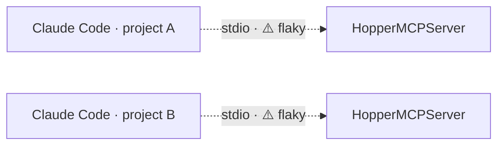
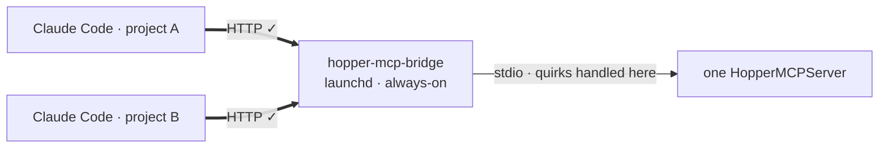

# hopper-claude-mcp-http-bridge

Put Hopper's built-in MCP server behind a local **HTTP** endpoint for Claude Code.

## The problem

Hopper 6+ has a built-in MCP server, but it only speaks **stdio**, and that channel
is flaky to drive directly. Why:

- **Interleaved notifications.** Hopper writes more than replies to stdout (log /
  progress notifications). A client that reads "one line = the response" grabs a
  notification instead and desyncs.
- **It's a GUI app, not a headless server.** The MCP server lazily launches the
  Hopper GUI on the first call, and has had crashes (e.g. when the window is
  minimized) and slow cold starts — the pipe doesn't behave like a normal daemon's.
- **Long calls.** Decompiling / analyzing a big binary easily exceeds the client's
  default stdio timeout (~60s), so the client kills the call.

Each client also spawns its **own** Hopper.



## The fix

One always-on local proxy: clients talk clean **HTTP**, the bridge owns the messy
stdio side and a **single shared** Hopper.



- **Same tools** — every tool stays Hopper's own, forwarded unchanged (`tools/list`,
  `tools/call`, plus `prompts`/`resources` when Hopper offers them).
- **Only two things change:** transport (stdio → HTTP) and process ownership
  (per-client → one shared, launchd-managed).
- Not a new MCP server — just a transport proxy in front of the official one.

## Requirements

- macOS · Claude Code · Python 3.10+
- **Hopper 6.0+** — the `HopperMCPServer` binary ships only with 6+ (4/5 have none).
  Auto-detected; override with `--hopper-path`.

## Install

```bash
cd hopper-mcp-bridge
python3.11 -m venv .venv && source .venv/bin/activate
pip install -e .
hopper-claude-mcp-http-bridge install     # run with Claude Code closed, then restart it
```

`install` does two things:

- adds `hopper` to `~/.claude.json` → `{ "type": "http", "url": ".../mcp/", "timeout": 300000 }`
- writes + loads a launchd agent (auto-starts on login)

Timeout is **300s** (`--tool-timeout-sec`) because RE calls blow past Claude's ~60s
default. If your build ignores the per-server `timeout`, set `MCP_TOOL_TIMEOUT` in
`~/.claude/settings.json` instead.

## Don't need the bridge?

Claude Code speaks stdio natively — if direct stdio already works for you, skip all this:

```bash
claude mcp add hopper -- "/Applications/Hopper Disassembler.app/Contents/MacOS/HopperMCPServer"
```

## Commands

| command | what it does |
|---|---|
| `serve` | run the bridge in the foreground |
| `install` / `uninstall` | register / remove (launchd agent + config entry) |
| `status` | url, timeout, `bridge_health`, `backend` |

Options: `--port`, `--server-name`, `--tool-timeout-sec`, `--hopper-path`, `--no-load-agent`.

## Verify

```bash
curl http://127.0.0.1:8765/healthz     # -> ok    (bridge process up)
curl http://127.0.0.1:8765/readyz      # -> JSON  (backend state + Hopper path)
hopper-claude-mcp-http-bridge status
```

`status` shows `bridge_health` (HTTP up) separately from `backend` (Hopper running /
binary present). `backend: missing-hopper-binary` → you need Hopper 6+.

## Notes

- A reader thread matches each response by id and skips interleaved notifications;
  every call is bounded by the timeout (a wedged call is killed and restarted).
- `mcp` is pinned `>=1.27,<2`: the low-level `Server` API changed in mcp 2.0, so an
  unpinned install breaks the bridge at startup.
- Logs: `~/.claude/logs/hopper-mcp-http-bridge.log` (+ `.stdout.log`, `.stderr.log`).

## License

MIT — see [`LICENSE`](../LICENSE).
